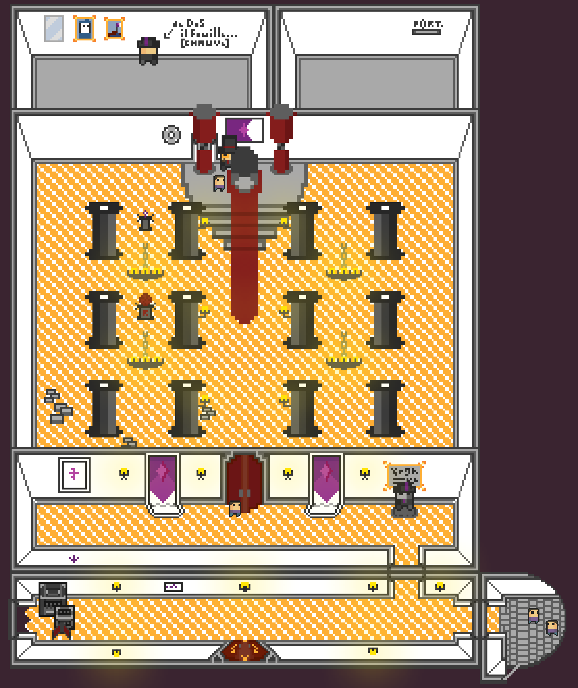

## Map Patch Note: 21-06-2022

### Patch Note

- add intersection to corridor
- bigger doors (eventually for a bigger character 1:1 instead of 6:10)
  - above and below
- cleaner door to put above (without frame)
- lights aura in corridors
- some better box in the first corridor
- nice transition between 2nd corridor floor and the Temple floor

### For Future days

- eventually animated curtains' shadows
- better museum props
- a nice and cooky secrete room

### README

hey you looking fine, my king <3

layer order :

ordres dans les layers:

- light on
- light off
- second_corridor_door
- first_corridor_doors
- balcony_door
- colonnes etc
- second_corridor_lights_ON
- 2nd corridor
- facade temple int (éventuellment)
- Temple base
- salle secrete du temple
- first_corridor_lights_ON
- Props 1rt corr
- first corridor
- jonction entre 1rt et 2nd corridor
- balcony
- background

(- 3e)
(- 2e)
(- 1e)
(- 0e)
### Actual Palette

31-05

### Additional Note

You can see this patchnote on the [Fabien's Brain](https://github.com/Wabtey/FABIENs_Brain)
