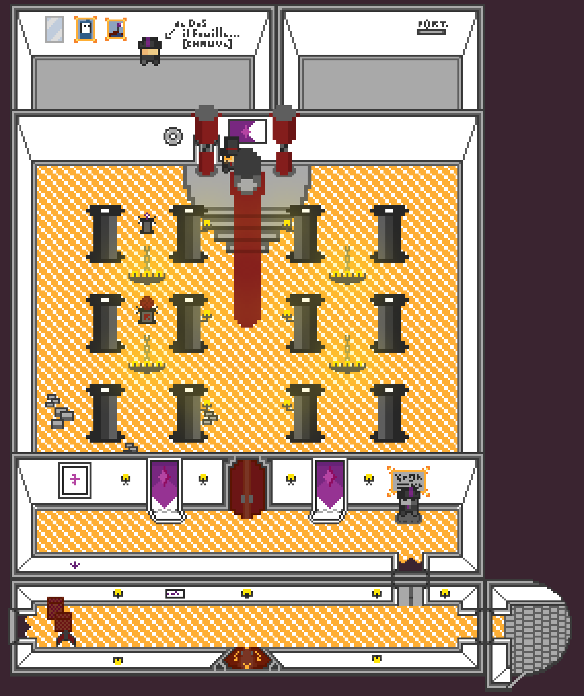

## Map Patch Note: 21-06-2022

### Patch Note

- add intersection to corridor
- bigger doors (eventually for a bigger character 1:1 instead of 6:10)
  - above and below
- cleaner door to put above (without frame)

### For Future days

- enventually some better box / animated curtains' shadows
- lights aura in corridors ?

### README

### Actual Palette

31-05

### Additional Note

You can see this patchnote on the [Fabien's Brain](https://github.com/Wabtey/FABIENs_Brain)
